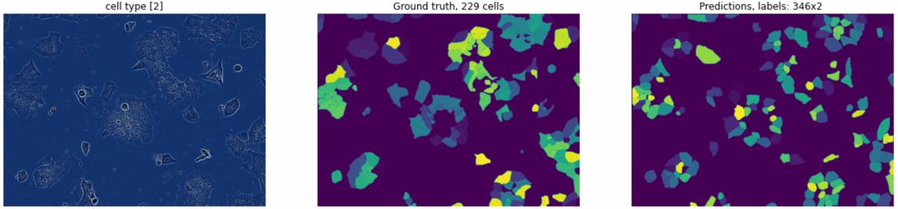

# Anadea Home Task - LIVECell Instance Segmentation

# You can try the model here
http://34.147.16.61:8501/

## Installation
> docker-compose -f docker-compose-cpu.yml up
>
> docker-compose -f docker-compose-cpu.yml start

## Sources
[LIVECell Dataset Page](https://sartorius-research.github.io/LIVECell/)

[Original Paper in Nature](https://www.nature.com/articles/s41592-021-01249-6.pdf)

[Metric Implementation](https://www.kaggle.com/code/theoviel/competition-metric-map-iou/notebook)

## Report
*This is a log of the progress made in the project*

### Evaluation
[Metric: mean of the precision values at each IoU threshold](https://www.kaggle.com/competitions/sartorius-cell-instance-segmentation/overview/evaluation)

### Important Papers to (re)visit
*Coming sooon*

### General
*Coming sooon*
- [x] Read the original paper ([LIVECell paper with notes.pdf](https://github.com/EugeneShalli/AnadeaHT/blob/main/LIVECell%20paper%20with%20notes.pdf))

### Data
*Coming sooon*

### Development
*Coming sooon*

### Model Design
*Coming sooon*

### Future work (improvements)
*Coming sooon*
